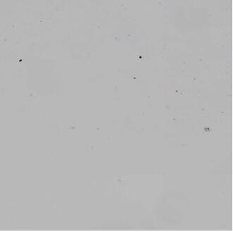
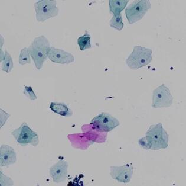
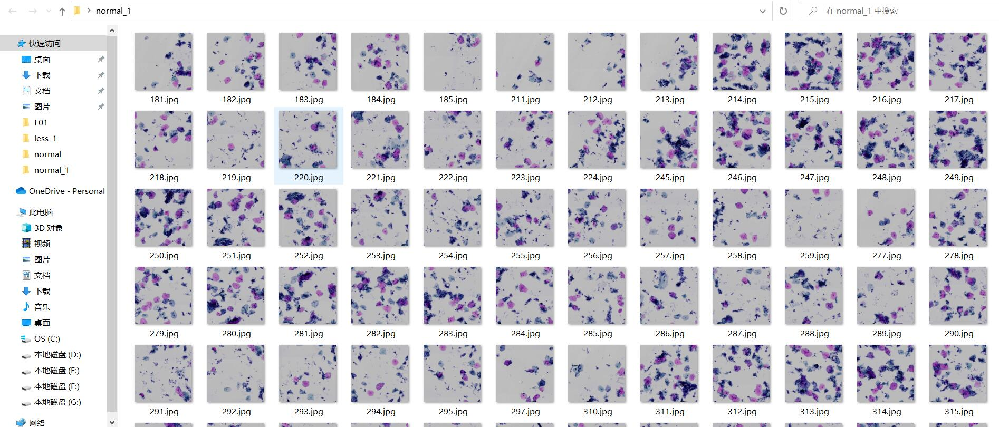
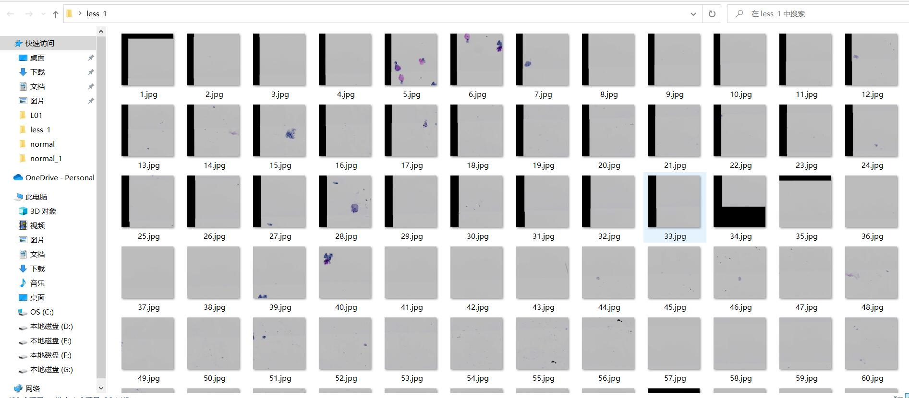
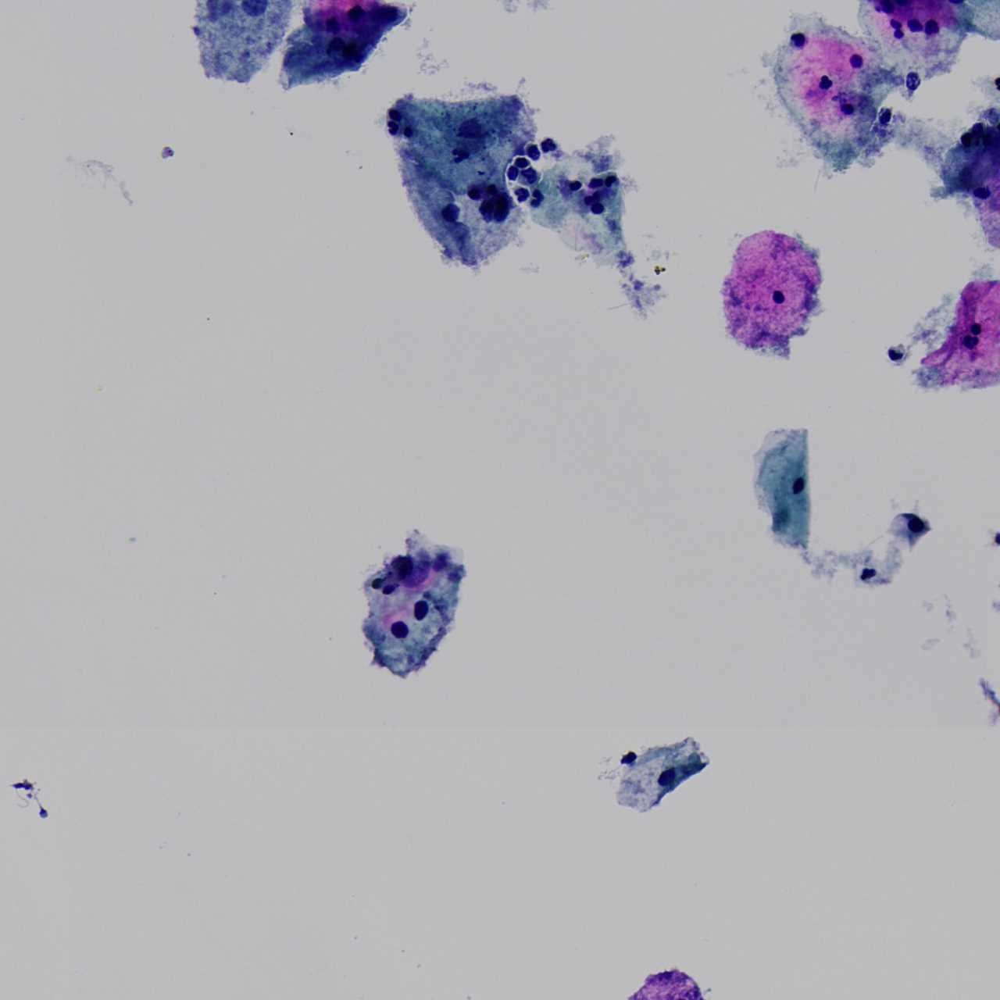
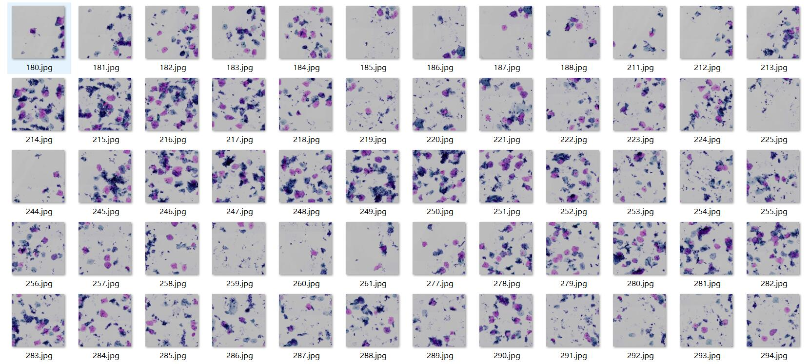
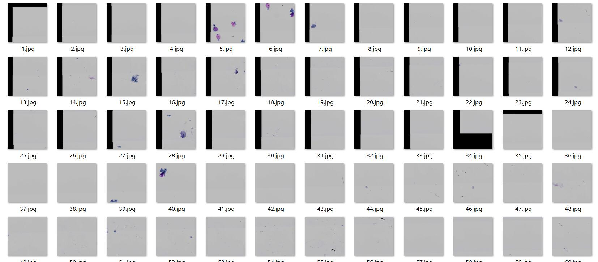
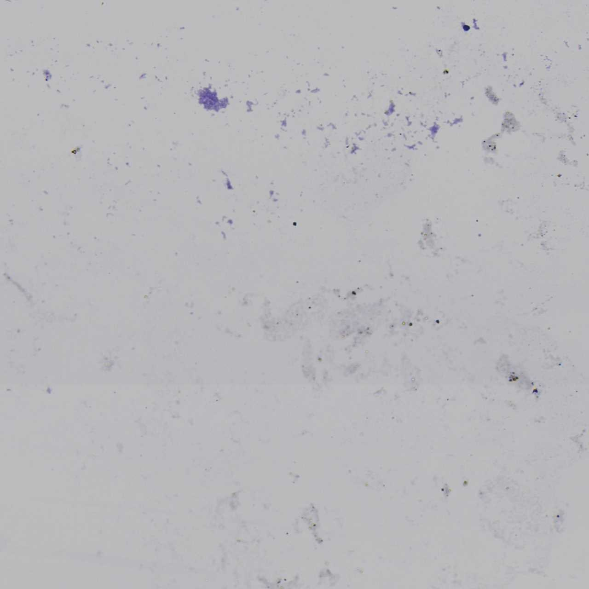
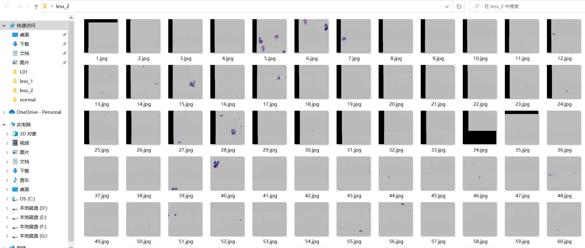
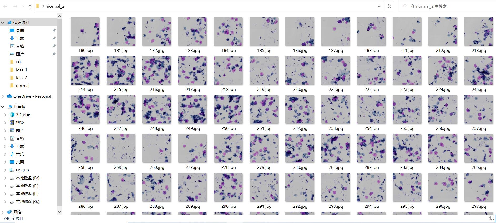

# 图片信息熵检测

## 1.任务说明：图片信息熵检测

任务说明：单个宫颈样本中，包含许多张图像，其中扫描得到的三分之一图像是无用的，也就是信息量比较少或者就是空白图像，因此需要找到这些图像将其排除掉，不做后续处理。具体图像如下：
信息量过少的图片

正常图片


## 2. 前置知识

1. 熵定义
    熵的概念最早起源于物理学，用于度量一个热力学系统的无序程度。在信息论里面，熵是对不确定性的测量。但是在信息世界，熵越高，则能传输越多的信息，熵越低，则意味着传输的信息越少。
    一个离散型随机变量$X$的熵$H(X)$定义为
    $$
        H(x)=-\sum_{x\in X} p(x)*\log p(x)
    $$
    定义特点为有明确定义的科学名词且与内容无关，而且不随信息的具体表达式的变化而变化。是独立于形式，反映了信息表达式中统计方面的性质。是统计学上的抽象概念。
2. 图片信息熵
    a. 一维熵
        是图像的一种特征的统计形式它反映了图像中平均信息量的多少。图像的一维熵表示图像中灰度分布的聚集特征所包含的信息量，令$P_i$ 表示图像中灰度值为$i$的像素所占的比例，则定义灰度图像的一维灰度熵为：
        $$
            H=-\sum_{i=0}^{i=255}p_i*\log p_i
        $$
    b. 二维熵
        图像的一维熵可以表示图像灰度分布的聚集特征，却不能反映图像灰度分布的空间特征，为了表征这种空间特征，可以在一维熵的基础上引入能够反映灰度分布空间特征的特征量来组成图像的二维熵。选择图像的邻域灰度均值作为灰度分布的空间特征量，与图像的像素灰度组成特征二元组，记为$( i, j )$，其中$i $表示像素的灰度值$(0\leq i \leq 255)$，$j$ 表示邻域灰度均值$(0\leq j\leq 255)$.
        $$
            P_{i,j}=\frac{f(i,j)}{W*H}
            (其中f(i,j)表示特征二元组(i,j)出现次数，W,H为图片尺寸)
        $$
        则二维图片信息熵为
        $$
            H=-\sum_{i=0}^{255} \sum_{j=0}^{255} P_{i,j} \log P_{i,j}
        $$

## 3. 解决过程

### 1. 基于图像一维熵来检测信息量

主要步骤如下：

1. 输入图像。
2. 统计各像素值出现概率。
3. 计算图像一维熵H。
4. 将H与预设阈值Threshold进行比较，判断图像是否有用。

经过若干尝试后，取阈值$Threshold=2.1$对原图像集进行分类。
分类结果：
正常图片：

信息量较少图片：


缺点：对于干净，清晰但细胞量较少的正常图片，其一维熵可能也较低，筛去了一些好的图片。
例：

上图一维熵为2.03093，主要因为图片除细胞外区域十分干净。

### 2. 基于图像二维熵来检测信息量

以中心点外八点作为邻域进行二维熵的计算,步骤如下。

1. 输入图像
2. 计算图像中每个像素点对应地K(取K=8)邻域像素均值
3. 统计各（像素值，K邻域像素均值）二元组出现概率。
4. 计算图像二维熵H。
5. 将H与预设阈值Threshold进行比较，判断图像是否有用

考虑到原有数据集较大，我们可以设计较高的阈值，使得划分出的正常数据集所含信息量更大一些，此处令阈值$Threshold=2.35$,对图片进行分类。
正常图片：

较少图片：


缺点：
    对于一些有污渍或细胞碎屑的图，即像素点领域像素变化大，但其实并没有有效信息的图，区分效果不是很好。
    例：
    
    这张图象的二维熵可以达到2.66

### 3. 基于图像二维熵和一维熵同时来检测信息量

只是用图像一维熵或二维熵的缺点与其定义有关，一维熵反映了图像的灰度聚集特征，二维熵反映了图像的分布特征，因此为了更好的图像信息检测，我们可以同时使用这两种方法，设置阈值进行分类。

步骤如下

1. 输入图像
2. 计算图像一维熵$H_1$。
3. 计算图像二维熵$H_2$。
4. 当$H_2>2.35\And H_1>2.0 或者H_2>2.2 \And H1>2.1$是认为是正常图片

用以上方法可以去除二维熵的缺点，减少细胞碎片及污渍对熵的干扰，同时对于整洁的但细胞量少的图减少误判的可能，此处阈值参数可以适当调整。

结果：
信息量少的图片

正常图片


## 4. 科研训练成果

1. 学习到了信息熵及图像熵的相关知识，对图像信息熵的计算有了一定的了解。
2. 认识到了python语言和C++语言在效率上的一些差距：

    在运行 python的求图像二维信息熵代码同时调用opencv库时，同样的一张$1280*1280$的图片需要运行$13.92$秒的时间，而在C++中只需$457ms$,性能差距达到了$32$倍多,对于一千规模的图像集，分类一次需要若干小时的时间是不可接受的。最终配置了vs studio上的opencv环境来运行代码。
3. 在之后机器学习数据预处理方法上有了一定的认识,为后续机器学习打下基础。

## 5.源码

### python 求图像二维信息熵源码

```python
import cv2
import matplotlib.pyplot as plt
import numpy as np
import os
import glob
import time
def calc_2D_Entropy(x):
    img=cv2.imread(x,0)#读取图像
    S=img.shape
    print(S)
    IJ=[]
    F={}
    Start_time = time.perf_counter()
    for row in range(S[0]):
        for col in range(S[1]):
            Left_x=max(0,col-1)
            Right_x=min(S[1],col+2)
            up_y=max(0,row-1)
            down_y=min(S[0],row+2)
            region=img[up_y:down_y,Left_x:Right_x] # 九宫格区域
            j=(np.sum(region)-img[row][col])/(8)
            IJ.append((img[row][col],j))
            F[(img[row][col],j)]=0
    End_time = time.perf_counter()
    print("程序运行时间:%s秒" % ((End_time - Start_time)))
    for i in IJ:
        F[i]=F[i]+1
    sq=(int)(S[0]*S[1])#计算pij
    G=F.values()
    P=[]
    for i in G:
        P.append(i/sq)
    End_time = time.perf_counter()
    print("程序运行时间:%s秒" % ((End_time - Start_time)))
    E=np.sum([p*np.log2(p) for p in P])#二维熵
    print("E=",E)
    
if __name__== "__main__" :
    Start_time = time.perf_counter()
    WSI_MASK_PATH = 'C:\\Users\\Mr_cold\\Desktop\\data\\L01'#存放图片的文件夹路径
    paths = glob.glob(os.path.join(WSI_MASK_PATH, '*.jpg'))
    print(paths)
    for x in paths:
        calc_2D_Entropy(x)
    End_time = time.perf_counter()
    print("程序运行时间:%s秒" % ((End_time - Start_time)))

```

### C++ openev 一维熵和二维熵的求解

```C++
#include<cstdio>
#include<iostream> 
#include<fstream>
# include "time.h"
#include <opencv2/core/core.hpp>
#include <opencv2/highgui/highgui.hpp>
#include <opencv2/imgproc/imgproc.hpp>
using namespace cv;
using namespace std;

double solve2(string s) {
 Mat img = imread(s);
 cv::cvtColor(img, img, cv::COLOR_BGR2GRAY);
 img.convertTo(img, CV_64F);
 cv::Mat imgEntropyMap = cv::Mat::zeros(256, 256, CV_64F);// 256 * 256 entropy map
 //calculate the mean value of K=8 neighborhood
 cv::Mat meanKernal(3, 3, CV_16S);
 short mean[]{ 1,1,1,
    1,0,1,
    1,1,1 };
 meanKernal.data = (unsigned char*)mean;
 cv::Mat meanMap;
 cv::filter2D(img, meanMap, -1, meanKernal, cv::Point(-1, -1), 0.0, cv::BORDER_REFLECT_101);
 meanMap /= 8;

 //calculate the (intensity, mean intensity of the K=8 neighborhood) two-tuples of the image
 img.convertTo(img, CV_8UC1);
 meanMap.convertTo(meanMap, CV_8UC1);
 for (int i=0; i < meanMap.rows; ++i)
  for (int j=0; j < meanMap.cols; ++j) {
   imgEntropyMap.at<double>(img.at<uchar>(i, j), meanMap.at<uchar>(i, j))++;
  }
 //calculate the two dimensional entropy of the image
  int S = (int)img.rows * img.cols;
 imgEntropyMap /= (S);
 cv::Mat logMap;
 cv::log(imgEntropyMap + 1e-7, logMap);//add delta=1e-7 to avoid overflow
 imgEntropyMap = imgEntropyMap.mul(logMap);
 double ans = -cv::sum(imgEntropyMap)[0];
 return ans;
}
string o0 = "C:\\Users\\Mr_cold\\Desktop\\less\\";
string o1 = "C:\\Users\\Mr_cold\\Desktop\\normal\\";
int num = 0;
void OUT(string s, int flag) {
 Mat img = imread(s);
 num++;
   if(flag==0)imwrite(o0+ to_string(num)+".jpg", img);
 else imwrite(o1 + to_string(num) + ".jpg", img);
}
string o10 = "C:\\Users\\Mr_cold\\Desktop\\less_1\\";
string o11 = "C:\\Users\\Mr_cold\\Desktop\\normal_1\\";
int num1 = 0;
void OUT1(string s, int flag) {
 Mat img = imread(s);
 num1++;
 if (flag == 0)imwrite(o10 + to_string(num1) + ".jpg", img);
 else imwrite(o11 + to_string(num1) + ".jpg", img);
}

double solve1(string s) {
 Mat img = imread(s);
 cv::cvtColor(img, img, cv::COLOR_BGR2GRAY);
 vector<double>cnt(256);
 img.convertTo(img, CV_8UC1);
 for (int i = 0; i < img.rows; ++i)
  for (int j = 0; j < img.cols; ++j) {
   cnt[img.at<uchar>(i, j)] += 1;
  }
 //calculate the two dimensional entropy of the image
 int S = (int)img.rows * img.cols;
 double sum = 0;
 for (auto x : cnt) {
  x += 1e-7;
  x /= S;
  x = x * log(1/x);
  sum += x;
 }
 return sum;
}
string o20 = "C:\\Users\\Mr_cold\\Desktop\\less_2\\";
string o21 = "C:\\Users\\Mr_cold\\Desktop\\normal_2\\";
int num2 = 0;
void OUT2(string s, int flag) {
 Mat img = imread(s);
 num2++;
 if (flag == 0)imwrite(o20 + to_string(num2) + ".jpg", img);
 else imwrite(o21 + to_string(num2) + ".jpg", img);
}
int main(){
 clock_t start_time, end_time;
 start_time = clock();   //获取开始执行时间

 ifstream fin("C:\\Users\\Mr_cold\\Desktop\\in.txt");
 string s;
 while (fin>>s) {
  double tmp=solve2(s);
  cout << tmp << endl;

  double tep = solve1(s);
  cout << tep << endl;
  
  if (tmp >= 2.35 && tep >= 2.0) OUT2(s, 1);
  else if (tmp >= 2.2 && tep >= 2.1) OUT2(s, 1);
  else OUT2(s, 0);
  cout << endl;
 }
 end_time = clock();     //获取结束时间
 float Times = (end_time - start_time) / CLOCKS_PER_SEC;
 printf("%f seconds\n", Times);
}
```
